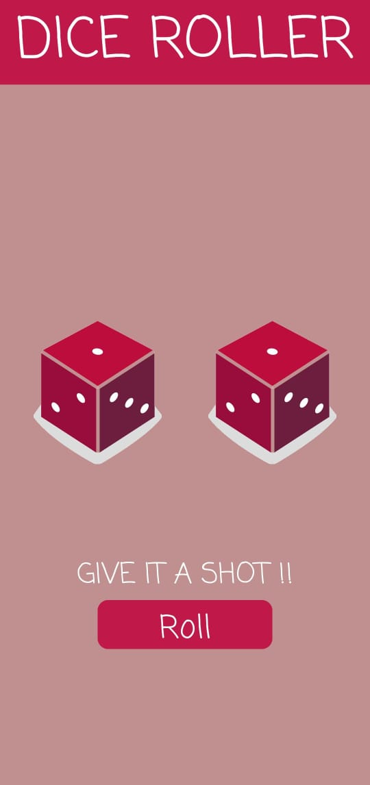
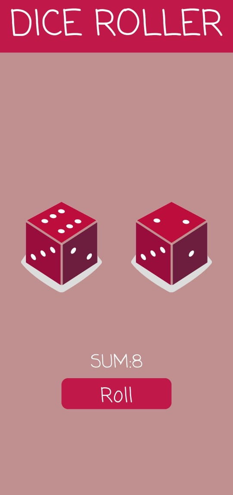

# Dice Roller App
A simple dice roller app built for Android.

# This app demonstrates fundamental Android development concepts including:

- User interface creation with XML layouts
- Generating random numbers
- Displaying text in TextViews
- Basic Kotlin syntax and control flow

# Key features:

- Rolls multiple dice
- Displays the result of each die
- Calculates and displays the sum of the rolled dice

 # App Snapshots
 
  
  
